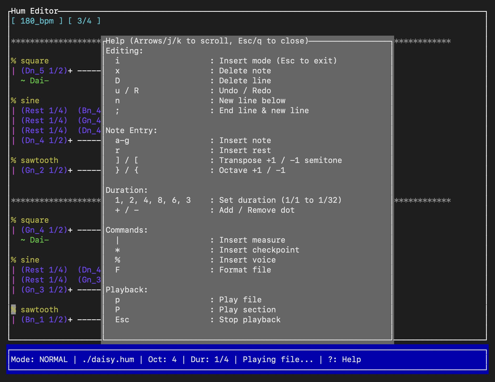

Hum Synthesizer 0.7.0-dev 👄
============================
A music notation language and synthesizer written in Rust.



Hum converts markup text files to playable music saved as WAV files. It also includes an interactive terminal-based editor for composing music.

_This project is in early development, and its public API is possibly subject to breaking changes at any time. If I knowingly make a breaking change, I will update the MINOR version in the semantic versioning scheme, where the version numbers are MAJOR.MINOR.PATCH._

_DISCLAIMER: This program produces sound output in the form of \*.wav files, and it is not yet considered stable. You should turn down your volume before experimenting with sound output to protect your ears and speakers._

<a name="requirements"></a>
Requirements
------------
- Rust: https://rust-lang.org/tools/install/

Building the Project
--------------------
To build the project, use `cargo build` in the root directory.

Testing the Project
-------------------
To test the project, use `cargo test` in the root directory.

Using the CLI
-------------
Hum has two modes of operation: **Conversion** and **Editing**.

### 1. Conversion Mode
To convert a \*.hum file to a \*.wav file, provide the input and output paths:

`cargo run daisy.hum daisy.wav`

### 2. Editor Mode
To open the interactive terminal editor, use the `edit` subcommand followed by the filename:

`cargo run edit mysong.hum`

If the file does not exist, it will be created.

Installing the Latest Release
-----------------------------
To install the latest release as a CLI tool, first make sure that you have fulfilled the requirements by [_installing Rust_](#requirements).

Then you can run the following command in the terminal:

`cargo install hum`

Now you can use hum like any other CLI tool:

```bash
# Convert a file
hum daisy.hum daisy.wav

# Edit a file
hum edit mysong.hum
```

Using Hum as a Library
----------------------
You can also use Hum as a library in your own Rust programs.

```rust
extern crate hum;
...
hum::convert_to_wav(input, output);
```

Interactive Editor Controls
---------------------------
The Hum editor is a modal editor (similar to Vim) with the following controls:

**Navigation:**
- `h`, `j`, `k`, `l` / Arrows: Move cursor
- `m` / `M`: Next / Previous measure
- `>` / `<`: Next / Previous note

**Editing:**
- `i`: Enter Insert mode (Esc to exit)
- `x`: Delete note
- `D`: Delete line
- `u` / `R`: Undo / Redo
- `n`: Insert new line below
- `;`: End line & start new line

**Note Entry:**
- `a`-`g`: Insert note (e.g., 'c' inserts 'Cn')
- `r`: Insert rest
- `]` / `[`: Transpose +1 / -1 semitone
- `}` / `{`: Octave +1 / -1

**Duration:**
- `1`, `2`, `4`, `8`, `6`, `3`: Set duration (1/1 to 1/32)
- `+` / `-`: Add / Remove dot

**Commands:**
- `|`: Insert measure
- `*`: Insert checkpoint
- `%`: Insert voice
- `F`: Format file

**Playback:**
- `p`: Play entire file
- `P`: Play section (from last checkpoint)
- `Esc`: Stop playback

**General:**
- `w`: Save file
- `q`: Quit
- `?`: Toggle Help

An Explanation of the Hum Music Notation Language
-------------------------------------------------
The Hum music notation language is designed to be easily interpreted by both human musicians and computers. While it is still in early development and subject to change, the following is a brief explanation of the features available so far. We encourage you to examine the included example files and modify them to better understand how the language works.

Here is an example of what the language looks like:

```
~ DAISY BELL by Harry Dacre
~ Based on an 1892 print in The Johns Hopkins University Lester S Levy Sheet Music Collection
~ Arranged by Connor Bulakites to demonstrate the Hum Synthesizer

[ 180_bpm ] [ 3/4 ]

*********************************************************************************************

% square
| (Dn_5 1/2)+ ----------------------- | (Bn_4 1/2)+ ----------------------- ;
  ~ Dai-                                ~ sy!

% sine
| (Rest 1/4)  (Bn_4 1/4)  (Bn_4 1/4)  | (Rest 1/4)  (Gn_4 1/4)  (Gn_4 1/4)  ;
| (Rest 1/4)  (Gn_4 1/4)  (Gn_4 1/4)  | (Rest 1/4)  (Dn_4 1/4)  (Dn_4 1/4)  ;
| (Rest 1/4)  (Dn_4 1/4)  (Dn_4 1/4)  | (Rest 1/4)  (Bn_3 1/4)  (Bn_3 1/4)  ;
| (Dn_4 1/2)+ ----------------------- | (Bn_3 1/2)+ ----------------------- ;

% sawtooth
| (Gn_2 1/2)+ ----------------------- | (Dn_2 1/2)+ ----------------------- ;


*********************************************************************************************

% square
| (Gn_4 1/2)+ ----------------------- | (Dn_4 1/2)+ ----------------------- ;
  ~ Dai-                                ~ sy!

% sine
| (Rest 1/4)  (Dn_4 1/4)  (Dn_4 1/4)  | (Rest 1/4)  (Bn_3 1/4)  (Bn_3 1/4)  ;
| (Rest 1/4)  (Gn_3 1/4)  (Gn_3 1/4)  | (Rest 1/4)  (Gn_3 1/4)  (Gn_3 1/4)  ;
| (Gn_3 1/2)+ ----------------------- | (Dn_3 1/2)+ ----------------------- ;

% sawtooth
| (Bn_1 1/2)+ ----------------------- | (Gn_1 1/2)+ ----------------------- ;

*********************************************************************************************

% square
| (En_4 1/4)  (Fs_4 1/4)  (Gn_4 1/4)  | (En_4 1/2) ------------ (Gn_4 1/4)  ;
  ~ Give      ~ me        ~ your        ~ an-                   ~ swer,

% sine
| (En_3 1/4)  (Fs_3 1/4)  (Gn_3 1/4)  | (En_3 1/2) ------------ (Gn_3 1/4)  ;

% sawtooth
| (Cn_1 1/4)  (Rest 1/2) ------------ | (Cn_1 1/4)  (Rest 1/2) ------------ ;
| (Rest 1/4)  (Cn_4 1/4)  (Cn_4 1/4)  | (Rest 1/4)  (Cn_4 1/4)  (Cn_4 1/4)  ;
| (Rest 1/4)  (Gn_3 1/4)  (Gn_3 1/4)  | (Rest 1/4)  (Gn_3 1/4)  (Gn_3 1/4)  ;
| (Rest 1/4)  (En_3 1/4)  (En_3 1/4)  | (Rest 1/4)  (En_3 1/4)  (En_3 1/4)  ;

*********************************************************************************************

% square
| (Dn_4 1/2)+ ----------------------- | (Dn_4 1/2) ------------ (Rest 1/4)  ;
  ~ do!

% sine
| (Rest 1/4)  (Bn_3 1/4)  (Bn_3 1/4)  | (Rest 1/4)  (Bn_3 1/4)  (Bn_3 1/4)  ;
| (Rest 1/4)  (Gn_3 1/4)  (Gn_3 1/4)  | (Rest 1/4)  (Gn_3 1/4)  (Gn_3 1/4)  ;
| (Dn_3 1/2)+ ----------------------- | (Dn_3 1/2)+ ----------------------- ;

% sawtooth
| (Gn_1 1/4)  (Dn_2 1/4)  (Bn_1 1/4)  | (Gn_1 1/4)  (Rest 1/2) ------------ ;

*********************************************************************************************

% square
| (An_4 1/2)+ ----------------------- | (Dn_5 1/2)+ ----------------------- ;
  ~ I'm                                 ~ half

% sine
| (An_3 1/2)+ ----------------------- | (Dn_4 1/2)+ ----------------------- ;

% sawtooth
| (Rest 1/4)  (Dn_4 1/4)  (Dn_4 1/4)  | (Rest 1/4)  (Cn_4 1/4)  (Cn_4 1/4)  ;
| (Rest 1/4)  (Cn_4 1/4)  (Cn_4 1/4)  | (Rest 1/4)  (Gn_3 1/4)  (Gn_3 1/4)  ;
| (Rest 1/4)  (An_3 1/4)  (An_3 1/4)  | (Rest 1/4)  (Fs_3 1/4)  (Fs_3 1/4)  ;
| (Fs_3 1/4)  (Rest 1/2) ------------ | (Dn_3 1/4)  (Rest 1/2) ------------ ;

*********************************************************************************************

% square
| (Bn_4 1/2)+ ----------------------- | (Gn_4 1/2)+ ----------------------- ;
  ~ cra-                                ~ zy

% sine
| (Rest 1/4)  (Gn_4 1/4)  (Gn_3 1/4)  | (Rest 1/4)  (Gn_4 1/4)  (Gn_4 1/4)  ;
| (Rest 1/4)  (Dn_4 1/4)  (Dn_3 1/4)  | (Rest 1/4)  (Dn_4 1/4)  (Dn_4 1/4)  ;
| (Bn_3 1/2)+ ----------------------- | (Gn_3 1/2)+ ----------------------- ;

% sawtooth
| (Gn_2 1/2)+ ----------------------- | (En_2 1/2)+ ----------------------- ;

*********************************************************************************************

% square
| (En_4 1/4)  (Fs_4 1/4)  (Gn_4 1/4)  | (An_4 1/2) ------------ (Bn_4 1/4)  ;
  ~ All       ~ for       ~ the         ~ love                  ~ of

% sine
| (En_3 1/4)  (Fs_3 1/4)  (Gn_3 1/4)  | (An_3 1/2) ------------ (Bn_3 1/4)  ;

% sawtooth
| (Rest 1/4)  (Cs_4 1/4)  (Cs_4 1/4)  | (Rest 1/4)  (Cs_4 1/4)  (Cs_4 1/4)  ;
| (Rest 1/4)  (An_3 1/4)  (An_3 1/4)  | (Rest 1/4)  (An_3 1/4)  (An_3 1/4)  ;
| (Rest 1/4)  (Gn_3 1/4)  (Gn_3 1/4)  | (Rest 1/4)  (Gn_3 1/4)  (Gn_3 1/4)  ;
| (An_3 1/4)  (Rest 1/2) ------------ | (An_3 1/4)  (Rest 1/2) ------------ ;

*********************************************************************************************

% square
| (An_4 1/2)+ ----------------------- | (An_4 1/4)  (Rest 1/4)  (Bn_4 1/4)  ;
  ~ you!                                                        ~ It

% sine
| (An_3 1/2)+ ----------------------- | (An_3 1/4)  (Rest 1/2) ------------ ;

% sawtooth
| (Rest 1/4)  (Dn_4 1/4)  (Dn_4 1/4)  | (Rest 1/4)  (Dn_4 1/4)  (Dn_4 1/4)  ;
| (Rest 1/4)  (An_3 1/4)  (An_3 1/4)  | (Rest 1/4)  (An_3 1/4)  (An_3 1/4)  ;
| (Rest 1/4)  (Fs_3 1/4)  (Fs_3 1/4)  | (Rest 1/4)  (Fs_3 1/4)  (Fs_3 1/4)  ;
| (Dn_3 1/4)  (Rest 1/2) ------------ | (Dn_3 1/4)  (Rest 1/2) ------------ ;

*********************************************************************************************

% square
| (Cn_5 1/4)  (Bn_4 1/4)  (An_4 1/4)  | (Dn_5 1/2) ------------ (Bn_4 1/4)  ;
  ~ won't     ~ be        ~ a           ~ sty-                  ~ lish

% sine
| (Cn_4 1/4)  (Bn_3 1/4)  (An_3 1/4)  | (Dn_4 1/2) ------------ (Bn_3 1/4)  ;

% sawtooth
| (Rest 1/4)  (Dn_4 1/4)  (Dn_4 1/4)  | (Rest 1/4)  (Cn_4 1/4)  (Cn_4 1/4)  ;
| (Rest 1/4)  (Cn_4 1/4)  (Cn_4 1/4)  | (Rest 1/4)  (Gn_3 1/4)  (Gn_3 1/4)  ;
| (Rest 1/4)  (An_3 1/4)  (An_3 1/4)  | (Rest 1/4)  (Fs_3 1/4)  (Fs_3 1/4)  ;
| (Fs_3 1/4)  (Rest 1/2) ------------ | (Dn_3 1/4)  (Rest 1/2) ------------ ;

*********************************************************************************************

% square
| (An_4 1/4)  (Gn_4 1/2) ------------ | (Gn_4 1/2) ------------ (An_4 1/4)  ;
  ~ mar-      ~ riage,                  ~ O                     ~ I

% sine
| (An_3 1/4)  (Gn_3 1/2) ------------ | (Gn_3 1/2) ------------ (An_3 1/4)  ;

% sawtooth
| (Rest 1/4)  (Dn_4 1/4)  (Dn_4 1/4)  | (Rest 1/4)  (Dn_4 1/4)  (Dn_4 1/4)  ;
| (Rest 1/4)  (Bn_3 1/4)  (Bn_3 1/4)  | (Rest 1/4)  (Bn_3 1/4)  (Bn_3 1/4)  ;
| (Gn_3 1/4)  (Rest 1/2) ------------ | (Gn_2 1/4)  (Rest 1/2) ------------ ;

*********************************************************************************************

% square
| (Bn_4 1/2) ------------ (Gn_4 1/4)  | (En_4 1/2) ------------ (Gn_4 1/4)  ;
  ~ can't                 ~ af-         ~ fford                 ~ a

% sine
| (Bn_3 1/2) ------------ (Gn_3 1/4)  | (En_3 1/2) ------------ (Gn_3 1/4)  ;

% sawtooth
| (Rest 1/4)  (En_4 1/4)  (En_4 1/4)  | (Rest 1/4)  (Cn_4 1/4)  (Cn_4 1/4)  ;
| (Rest 1/4)  (Bn_3 1/4)  (Bn_3 1/4)  | (Rest 1/4)  (Gn_3 1/4)  (Gn_3 1/4)  ;
| (Rest 1/4)  (Gn_3 1/4)  (Gn_3 1/4)  | (Rest 1/4)  (En_3 1/4)  (En_3 1/4)  ;
| (En_2 1/4)  (Rest 1/2) ------------ | (Cn_2 1/4)  (Rest 1/2) ------------ ;

*********************************************************************************************

% square
| (En_4 1/4)  (Dn_4 1/2) ------------ | (Dn_4 1/4)  (Rest 1/4)  (Dn_4 1/4)  ;
  ~ car-      ~ riage,                                          ~ but

% sine
| (En_3 1/4)  (Dn_3 1/2) ------------ | (Dn_3 1/4)  (Rest 1/4)  (Dn_3 1/4)  ;

% sawtooth
| (Rest 1/4)  (Bn_3 1/4)  (Bn_3 1/4)  | (Rest 1/4)  (Cn_4 1/4)  (Cn_4 1/4)  ;
| (Rest 1/4)  (Gn_3 1/4)  (Gn_3 1/4)  | (Rest 1/4)  (An_3 1/4)  (An_3 1/4)  ;
| (Rest 1/4)  (Dn_3 1/4)  (Dn_3 1/4)  | (Rest 1/4)  (Dn_3 1/4)  (Dn_3 1/4)  ;
| (Gn_1 1/4)  (Rest 1/2) ------------ | (Fs_1 1/4)  (Rest 1/2) ------------ ;

*********************************************************************************************

% square
| (Gn_4 1/2) ------------ (Bn_4 1/4)  | (An_4 1/4)  (Rest 1/4)  (An_4 1/4)  ;
  ~ you'll-               ~ look        ~ sweet,                ~ up-

% sine
| (Gn_3 1/2) ------------ (Bn_3 1/4)  | (An_3 1/4)  (Rest 1/4)  (An_3 1/4)  ;

% sawtooth
| (Rest 1/4)  (Bn_3 1/4)  (Bn_3 1/4)  | (Rest 1/4)  (Cn_4 1/4)  (Cn_4 1/4)  ;
| (Rest 1/4)  (Gn_3 1/4)  (Gn_3 1/4)  | (Rest 1/4)  (An_3 1/4)  (An_3 1/4)  ;
| (Rest 1/4)  (Dn_3 1/4)  (Dn_3 1/4)  | (Rest 1/4)  (Dn_3 1/4)  (Dn_3 1/4)  ;
| (Gn_2 1/4)  (Rest 1/2) ------------ | (Fs_2 1/4)  (Rest 1/2) ------------ ;

*********************************************************************************************

% square
| (Gn_4 1/2) ------------ (Bn_4 1/4)  | (An_4 1/4)  (Rest 1/4)  (Bn_4 1/8)  (Cn_5 1/8)  ;
  ~ on                    ~ the         ~ seat                  ~ of        ~ a

% sine
| (Gn_3 1/2) ------------ (Bn_3 1/4)  | (An_3 1/4)  (Rest 1/4)  (Bn_3 1/8)  (Cn_4 1/8)  ;

% sawtooth
| (Rest 1/4)  (Bn_3 1/4)  (Bn_3 1/4)  | (Rest 1/4)  (Cn_4 1/4)  (Cn_4 1/4) ------------ ;
| (Rest 1/4)  (Gn_3 1/4)  (Gn_3 1/4)  | (Rest 1/4)  (An_3 1/4)  (An_3 1/4) ------------ ;
| (Rest 1/4)  (Dn_3 1/4)  (Dn_3 1/4)  | (Rest 1/4)  (Dn_3 1/4)  (Dn_3 1/4) ------------ ;
| (Gn_2 1/4)  (Rest 1/2) ------------ | (Fs_2 1/4)  (Rest 1/2) ------------------------ ;

*********************************************************************************************

% square
| (Dn_5 1/4)  (Bn_4 1/4)  (Gn_4 1/4)  | (An_4 1/2) ------------ (Dn_4 1/4)  ;
  ~ bi-       ~ cy-       ~ cle         ~ built                 ~ for

% sine
| (Dn_4 1/4)  (Bn_3 1/4)  (Gn_3 1/4)  | (An_3 1/2) ------------ (Dn_3 1/4)  ;

% sawtooth
| (Rest 1/4)  (Bn_3 1/4)  (Bn_3 1/4)  | (Rest 1/4)  (Cn_4 1/4)  (Cn_4 1/4)  ;
| (Rest 1/4)  (Gn_3 1/4)  (Gn_3 1/4)  | (Rest 1/4)  (Gn_3 1/4)  (Gn_3 1/4)  ;
| (Rest 1/4)  (Dn_3 1/4)  (Dn_3 1/4)  | (Rest 1/4)  (Dn_3 1/4)  (Dn_3 1/4)  ;
| (Gn_2 1/4)  (Rest 1/2) ------------ | (Dn_2 1/4)  (Rest 1/2) ------------ ;

*********************************************************************************************

% square
| (Gn_4 1/2)+ ----------------------- | (Gn_4 1/2)+  ;
  ~ two!

% sine
| (Gn_5 1/2)+ ----------------------- | (Gn_5 1/2)+  ;
| (Gn_3 1/2)+ ----------------------- | (Gn_3 1/2)+  ;

% sawtooth
| (Gn_2 1/4)  (Dn_2 1/4)  (Bn_1 1/4)  | (Gn_1 1/2)+  ;

```

### Language Features

- **Comments:** The tilde character `~` indicates a single-line comment. Everything that appears after this symbol on a line is ignored by the computer. This is useful for annotations and lyrics.

- **Tempo:** The tempo tag `[ 100_bpm ]` sets the tempo of the song to 100 _beats per minute_. You can change the numeric portion of the tag to adjust the tempo, but you must keep the `_bpm` suffix. You can change the tempo partway through a song by placing another tempo tag between any two measures.

- **Time Signature:** The time signature tag `[ 3/4 ]` sets the time signature of the music. The numerator corresponds to the number of beats per measure, and the denominator corresponds to the reciprocal of the length value of one beat. For example, in 3/4 time, there are 3 beats with length "1/4" per measure. You can change the time signature partway through a song by placing another time signature tag between any two measures.

- **Checkpoints:** The line of asterisks `*` indicates a write checkpoint. You should have at least one of these before your first measure. _All lines of music written before the next checkpoint are presumed to occur concurrently_. Lines of music written after the next checkpoint are presumed to start immediately after the last measure in the previous checkpoint.

- **Voices:** The division sign `%` is used to switch the voice or "instrument" of lines of music. When you switch to a particular voice, all lines of music underneath the command will be played with that voice until you switch to a new voice. Currently, there are three supported voices: `sine`, `square`, and `sawtooth`.

- **Measures:** The pipe operator `|` indicates the start of a new measure. To ensure that your music is played back correctly, _you must start every measure with the pipe operator_. Additionally, ensure that the total length of notes and rests in your measure adds up to the value of the current time signature.

- **Reset Character:** The semicolon `;` serves as the reset character. When a semicolon is encountered, Hum knows that you are done writing one line of music and want to start writing another line of music starting at the last checkpoint. Typically, _all lines of music after a checkpoint which are meant to be played concurrently should end in a semicolon_.

- **Alignment:** Hum ignores minus signs `-`. They are treated as whitespace. This allows you to vertically align concurrent lines of music within a checkpoint for better readability.

### Notes

- A note consists of two values enclosed within parentheses and separated by a space: `(NoteName Length)`. The note length divided by the current time signature determines the fraction of the measure that the note occupies.

- The `+` operator can be appended to the end of a note outside the parentheses to increase the length of the note by one half of its original length value (equivalent to a "dot" in traditional notation). For example, `(An_4 1/2)+` has a total length of `1/2 + 1/4 = 3/4`.

- There are currently _96_ possible note names corresponding roughly to the keys on a grand piano. The note names are formatted as `{pitch}_{octave}`.

- **Sharps:** `["Cn", "Cs", "Dn", "Ds", "En", "Fn", "Fs", "Gn", "Gs", "An", "As", "Bn"]`
- **Flats:** `["Cn", "Df", "Dn", "Ef", "En", "Fn", "Gf", "Gn", "Af", "An", "Bf", "Bn"]`

- In this notation, "n" refers to "natural," "s" refers to "sharp," and "f" refers to "flat."

- The octave part of a note can range from 0 to 7 (e.g., `Cn_0` to `Bn_7`). Octave numbers roll over on C natural (e.g., `Bn_4` is followed by `Cn_5`).

- The special note `Rest` corresponds to silence within a single voice.

- To automatically format a *.hum file, you can press `shift+F` while in `Normal` mode in the editor. The formatter will vertically align notes in a section based on the beat, and it will also apply the default style rules. 

About the Project
-----------------
This project was created to explore the possibilities of a text-based music notation language that is easily readable by both humans and computers. The goal is to provide a simple yet powerful tool for composing and synthesizing music, potentially aiding in the digital preservation of musical scores. It also serves as an exploration of audio synthesis and application development in Rust.

License
-------
This project is licensed under the GNU General Public License (GPL). For more details, please refer to the `LICENSE` file included in the repository or visit [the GNU website](https://www.gnu.org/licenses/licenses.html).
